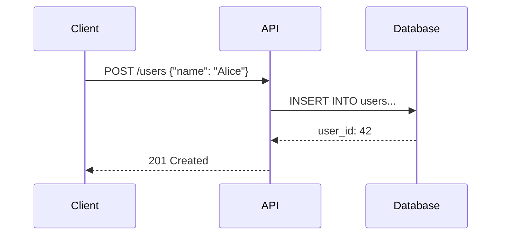

# TrueFlow
<svg xmlns="http://www.w3.org/2000/svg" viewBox="0 0 128 128">
  
  <rect width="128" height="128" rx="14" fill="#08080C"/>
  
  <!-- Input nodes -->
  <circle cx="16" cy="44" r="5" fill="#22C55E"/>
  <circle cx="16" cy="64" r="6" fill="#22C55E"/>
  <circle cx="16" cy="84" r="5" fill="#22C55E"/>
  
  <!-- Input flows -->
  <g fill="none" stroke="#22C55E" stroke-width="2" stroke-linecap="round">
    <path d="M 21 44 Q 32 44 38 54 Q 44 64 48 63"/>
    <path d="M 22 64 L 48 64"/>
    <path d="M 21 84 Q 32 84 38 74 Q 44 64 48 65"/>
  </g>
  
  <!-- Dead code - dashed line with X -->
  <path d="M 26 44 L 32 36" stroke="#EF4444" stroke-width="2" stroke-linecap="round" stroke-dasharray="3 2" opacity="0.6" fill="none"/>
  <circle cx="36" cy="32" r="5" fill="#EF4444" opacity="0.7"/>
  <line x1="34" y1="30" x2="38" y2="34" stroke="#08080C" stroke-width="2" stroke-linecap="round"/>
  <line x1="38" y1="30" x2="34" y2="34" stroke="#08080C" stroke-width="2" stroke-linecap="round"/>
  
  <!-- Eye with white sclera -->
  <path d="M 48 64 Q 56 52 64 52 Q 72 52 80 64 Q 72 76 64 76 Q 56 76 48 64 Z" 
        fill="#FFFFFF"/>
  <circle cx="64" cy="64" r="10" fill="#06B6D4"/>
  <circle cx="64" cy="64" r="7" fill="#0891B2"/>
  <circle cx="64" cy="64" r="4" fill="#08080C"/>
  <circle cx="64" cy="64" r="1.5" fill="#22C55E"/>
  <circle cx="61" cy="61" r="2" fill="#FFFFFF"/>
  
  <!-- Output flows -->
  <path d="M 80 60 Q 88 54 94 44" fill="none" stroke="#22C55E" stroke-width="2" stroke-linecap="round"/>
  <path d="M 80 64 L 96 64" fill="none" stroke="#F59E0B" stroke-width="2" stroke-linecap="round"/>
  <path d="M 80 68 Q 88 74 94 84" fill="none" stroke="#A855F7" stroke-width="2" stroke-linecap="round"/>
  
  <!-- Outputs -->
  <rect x="98" y="32" width="18" height="22" rx="3" fill="#22C55E"/>
  <rect x="102" y="36" width="2" height="14" fill="#08080C"/>
  <rect x="107" y="36" width="2" height="14" fill="#08080C"/>
  
  <rect x="96" y="52" width="22" height="24" rx="3" fill="#F59E0B"/>
  <rect x="100" y="56" width="14" height="16" rx="2" fill="#08080C"/>
  <polygon points="104,60 104,68 112,64" fill="#F59E0B"/>
  
  <rect x="98" y="78" width="18" height="22" rx="3" fill="#A855F7"/>
  <rect x="102" y="82" width="10" height="2" fill="#08080C"/>
  <rect x="102" y="86" width="8" height="2" fill="#08080C"/>
  <rect x="102" y="90" width="10" height="2" fill="#08080C"/>
  
</svg>

**Deterministic Visualizations & Explanations for Blackbox Code**

> *Copilot writes. Cursor generates. Claude produces. Legacy code just exists.*
> *TrueFlow reveals what it all actually does.*

---

## Why TrueFlow Exists

**Two types of code are equally terrifying:**

1. **AI-generated code** — Millions of lines pasted into production daily. The code works (mostly). But do you truly understand what it does? When you ask an LLM to explain its own code, trace methods, produce sequence diagram (not MCP based), you get probabilistic guesses dressed as confident explanations.

2. **Legacy codebases** — That 10-year-old monolith. The original authors left years ago. Documentation is a myth. Tribal knowledge lives in Slack threads from 2019. You're afraid to touch it because *nobody knows what it actually does anymore*.

Both share the same fundamental problem: **blackbox code**.

Whether it's Claude's 500-line async handler or that ancient Django app with 47 circular imports—you're navigating blind.

**You're debugging code without ground truth.**

We built TrueFlow because we were tired of:

| Pain Point | Reality |
|------------|---------|
| Writing loggers for every method | Just to trace a single flow |
| Paid sequence diagram tools | Outdated, limited, no animations |
| Static analysis OR runtime tracing | Never both. Always incomplete. |
| Multiple plugins duct-taped together | Coverage here, diagrams there, traces somewhere else |
| LLM explanations that sound right | But aren't grounded in actual execution |
| Legacy code with zero documentation | Original authors long gone, tribal knowledge lost |
| "Just read the code" | 500K lines across 12 services? Good luck. |
| Onboarding takes months | Because nobody can explain how it *actually* works |

**TrueFlow is the answer:** One tool. Zero code changes. Deterministic truth.

---

## What TrueFlow Does

```
┌─────────────────────────────────────────────────────────────────────────┐
│                           TrueFlow                                      │
│                                                                         │
│   AST Static Analysis  ──────┬──────  Runtime Tracing                   │
│                              │                                          │
│                              ▼                                          │
│                    ┌─────────────────┐                                  │
│                    │  Ground Truth   │                                  │
│                    └─────────────────┘                                  │
│                              │                                          │
│         ┌────────────────────┼────────────────────┐                     │
│         ▼                    ▼                    ▼                     │
│   ┌──────────┐        ┌────────────┐       ┌────────────┐               │
│   │ Mermaid  │        │   Manim    │       │ Local LLM  │               │
│   │ Diagrams │        │ Animations │       │ Summaries  │               │
│   └──────────┘        └────────────┘       └────────────┘               │
└─────────────────────────────────────────────────────────────────────────┘
```

TrueFlow intercepts actual execution, captures real data flow, and transforms it into visualizations and explanations grounded in **what happened**—not what an LLM thinks might have happened.

---

## Features

### Zero-Code Instrumentation

No SDK. No decorators. No logging boilerplate. No code changes whatsoever.

```bash
TRUEFLOW_ENABLED=1 python your_script.py
# That's it. Traces appear automatically.
```

Works with Python 2.7+ and 3.x. Universal compatibility.

---

### Auto Sequence Diagrams

Real method calls. Real arguments. Real return values. Exported to formats you already use.

**11+ Export Formats:**
PlantUML • Mermaid • D2 • JSON • Markdown • ASCII • Flamegraph • LLM-ready summaries



*This diagram was generated from actual execution—not imagination.*

---

### Manim Animated Visualizations

Static diagrams are dead. Watch your code execute.

Powered by Manim (the engine behind 3Blue1Brown), TrueFlow generates:

- **Animated architecture diagrams** — Components light up as they're invoked
- **Data flow cinematics** — Watch data transform as it moves through your system
- **Execution narratives** — Function calls choreographed as visual sequences

```bash
python ultimate_architecture_viz.py --trace traces/session_001.json


```
# Outputs: execution_flow.mp4

https://github.com/user-attachments/assets/e245296a-32f2-403b-9e13-b2c12e1e97bf

*Finally understand that 500-line async task queue Claude generated.*

---

### Hybrid Coverage Analysis

Static analysis tells you what *could* run. Runtime tracing tells you what *did* run.

TrueFlow combines both:

- **AST-based static analysis** — Map all possible paths
- **Runtime data coverage** — Record which paths executed with which data
- **Dead code detection** — Identify unreachable code with certainty
- **Semantic coverage** — Not just line coverage, but *meaning* coverage

---

### Auto-Instrumented Performance Profiling

Every method call. Timed. Automatically.

No decorators. No `@profile`. No manual instrumentation. TrueFlow injects timing at runtime and shows you exactly where time is spent.

---

### Local LLM Explanations (Qwen 2B)

Export traced execution to a lightweight local LLM for deterministic summarization.

- **Private** — Runs on your machine, on CPU (llama.cpp)
- **Fast** — 2B parameters, ~15-25 seconds per explanation
- **Grounded** — Explains what *actually happened*, not what might have happened
- **No cloud** — Your code never leaves your machine

---

### 29+ Protocol Detection

TrueFlow automatically recognizes and visualizes:

| Category | Protocols |
|----------|-----------|
| **Data** | SQL, GraphQL, gRPC, REST |
| **Messaging** | Kafka, Redis, MQTT, RabbitMQ |
| **Realtime** | WebSocket, WebRTC, SSE |
| **AI/Agents** | MCP, A2A, LangChain, AutoGen |

---

### Framework-Aware Tracing

Intelligent detection for modern and legacy stacks:

**Modern:**
- **Web:** FastAPI, Flask, Django, Starlette
- **AI/ML:** PyTorch, TensorFlow, LangChain, AutoGen, CrewAI
- **Data:** Pandas, NumPy, SQLAlchemy, Polars

**Legacy-Friendly:**
- **Classic Web:** Django 1.x, Flask 0.x, Tornado, CherryPy
- **Enterprise:** Celery, RabbitMQ consumers, legacy SOAP clients
- **Monoliths:** Works on any Python codebase, no matter how tangled

---

## Quick Start

### Option 1: PyCharm Plugin

```bash
git clone https://github.com/trueflow/TrueFlow.git
cd TrueFlow

# Build everything (installs Python deps + builds plugins)
build_all.bat              # Windows
./build_all.sh             # Linux/Mac

# Or build just the PyCharm plugin
./gradlew buildPlugin

# Install via: Settings → Plugins → Install from Disk
# Select: build/distributions/SequenceDiagramPython-*.zip
```

10-tab interface. Real-time visualization. One-click project integration.


---

### Option 2: VS Code Extension

```bash
cd TrueFlow/vscode-extension
npm install
npm run compile
npx vsce package

# Install the extension
code --install-extension trueflow-0.1.0.vsix
```


---

### Option 3: Standalone CLI

```bash
cd TrueFlow
pip install -e .

# Trace any Python script
PYCHARM_PLUGIN_TRACE_ENABLED=1 python your_script.py

# Find traces in ./traces/
ls traces/
# session_2024_01_15_143052.json
```

---

### Option 4: Generate Animations

```bash
cd TrueFlow/manim_visualizer
pip install -r requirements.txt

# Create video from trace
python ultimate_architecture_viz.py --trace traces/session_*.json

# Output: media/videos/execution_flow.mp4
```

---

## Build & Test

### Build All Components

```bash
# Windows - builds PyCharm plugin, VS Code extension, installs Python deps
build_all.bat

# With quick tests
build_all.bat --test

# Skip Python dependency installation
build_all.bat --skip-python

# Linux/Mac
./build_all.sh
./build_all.sh --test
```

### Run Full Test Suite (~163 tests)

```bash
# Windows
run_all_tests.bat

# Linux/Mac
./run_all_tests.sh
```

### Test Suites

| Suite | Tests | Description |
|-------|-------|-------------|
| Manim Unit Tests | 70 | Frame bounds, animation pacing, base visualizer |
| Visual Regression | 15 | Video quality, coordinate tracking |
| E2E Regression | 22 | Full workflow validation |
| Runtime Instrumentor | 18 | Core tracing functionality |
| Error Handling & E2E | 21 | Crash prevention, graceful degradation |
| Protocol Detection | 4 | SQL, WebSocket, gRPC detection |
| Manim Integration | 7 | Plugin integration tests |
| New Visualizers | 6 | Extended visualizer tests |
| **TOTAL** | **~163** | **Full regression suite** |

### Gradle Test Tasks

```bash
./gradlew runQuickTests        # Fast unit tests (~10s)
./gradlew runFastTests         # All except slow (~60s)
./gradlew runRegressionTests   # Full suite (~3-5 min)
./gradlew runIntegrationTests  # Integration only
./gradlew generateCoverageReport  # HTML coverage report
```

### Direct pytest

```bash
# Set PYTHONPATH first
export PYTHONPATH="$PWD/src/main/resources/runtime_injector:$PWD/src/main/resources:$PWD:$PWD/manim_visualizer"

# Run specific test files
python -m pytest tests/test_runtime_instrumentor_unit.py -v
python -m pytest tests/test_error_handling.py -v
python -m pytest manim_visualizer/tests/test_frame_bounds_validation.py -v
```

---

## How It Works

```
┌──────────────────────────────────────────────────────────────────┐
│  Your Python App Starts                                          │
│       │                                                          │
│       ▼                                                          │
│  TrueFlow Injector Loads (via PYTHONPATH/sitecustomize.py)       │
│       │                                                          │
│       ▼                                                          │
│  sys.settrace() Hooks Every Function Call                        │
│       │                                                          │
│       ▼                                                          │
│  Events Stream to Socket (port 5678)                             │
│       │                                                          │
│       ├──────────────────┬──────────────────┐                    │
│       ▼                  ▼                  ▼                    │
│  IDE Plugin         Manim Renderer     Local LLM                 │
│  (Real-time)        (Animations)       (Explanations)            │
└──────────────────────────────────────────────────────────────────┘
```

**Performance overhead:** < 2.5% (typically 0.1–0.5ms per request)

---

## Architecture

```
TrueFlow/
├── src/main/resources/
│   └── runtime_injector/      # Zero-code Python instrumentation
│       ├── python_runtime_instrumentor.py  # sys.settrace() hooks
│       ├── sitecustomize.py   # Auto-loader via PYTHONPATH
│       └── local_llm_server.py  # Local LLM integration
├── manim_visualizer/          # 3D animated execution videos
│   ├── ultimate_architecture_viz.py  # Main visualizer
│   ├── requirements.txt       # Manim dependencies
│   └── tests/                 # Visualization tests
├── src/main/kotlin/           # PyCharm plugin (Kotlin)
├── vscode-extension/          # VS Code extension (TypeScript)
├── tests/                     # Runtime injector tests
├── build_all.bat              # Build all components
├── run_all_tests.bat          # Run full test suite
└── setup.py                   # Python package setup
```

---

## Configuration

### Environment Variables

| Variable | Description | Default |
|----------|-------------|---------|
| `PYCHARM_PLUGIN_TRACE_ENABLED` | Enable tracing | `0` |
| `CRAWL4AI_TRACE_DIR` | Output directory | `./traces` |
| `PYTHONPATH` | Must include `.pycharm_plugin` | - |
| `CRAWL4AI_TRACE_MODULES` | Modules to trace (empty=all) | - |
| `PYCHARM_PLUGIN_SOCKET_SAMPLE_RATE` | Sample 1 in N events | `10` |
| `TRUEFLOW_SOCKET_PORT` | Trace server port | `5678` |

---

## Safety & Reliability

| Guarantee | Implementation |
|-----------|----------------|
| **Memory Safety** | Hard limit: 100,000 calls max |
| **Graceful Degradation** | TrueFlow failures never crash your app |
| **Zero Impact** | If tracing fails, your code runs normally |
| **Test Coverage** | 163 tests passing |

Your production code is sacred. TrueFlow observes without interfering.

---

## Use Cases

### Unblackboxing AI-Generated Code

```
You:     "Claude, write me an async task queue with retries"
Claude:  *generates 500 lines of asyncio spaghetti*
You:     *runs TrueFlow*
TrueFlow: *shows exactly how tasks flow, retry, and fail*
```

### Taming Legacy Monoliths

```
New Dev:   "How does the payment flow work?"
Team Lead: "Uh... check the PaymentService? Or maybe OrderProcessor?
            Actually, ask Dave. Oh wait, Dave left in 2021."
TrueFlow:  *traces actual checkout → shows 47 classes, 3 services,
            2 message queues, and that weird singleton everyone forgot about*
```

### Onboarding in Hours, Not Months

New engineers run TrueFlow on key user journeys. Within hours, they have:
- Animated architecture diagrams of real execution paths
- Sequence diagrams showing actual class interactions
- Data flow visualizations with real payloads
- Auto-generated documentation grounded in truth

No more "shadow a senior dev for 3 months."

### Safe Refactoring of Legacy Code

Before touching that 10-year-old module:
1. Run TrueFlow on production traffic patterns
2. Capture actual execution paths and dependencies
3. Refactor with confidence—you know what *really* gets called
4. Compare before/after traces to verify behavior preservation

---

## Roadmap

- [x] PyCharm plugin (10-tab interface)
- [x] VS Code extension
- [x] Mermaid/PlantUML/D2 export
- [x] Manim visualizations
- [x] Local LLM explanations (Qwen 2B via llama.cpp)
- [x] 163 regression tests
- [ ] Browser-based viewer
- [ ] Java/TypeScript support
- [ ] Distributed tracing correlation

---

## Contributing

We welcome contributions. See [CONTRIBUTING.md](docs/CONTRIBUTING.md).

**Ways to help:**
- Report bugs and request features
- Submit pull requests
- Improve documentation
- Create visualization themes
- Build additional IDE extensions

---

## License

MIT License — See [LICENSE](LICENSE)

---

## The Bottom Line

**Two forces are making code harder to understand:**

1. LLMs generate code at superhuman speed
2. Legacy systems accumulate complexity over decades

Both create blackbox code. Understanding it at human speed is the bottleneck.

**TrueFlow closes the gap.**

No more hallucinated explanations. No more guesswork diagrams. No more "ask Dave, oh wait Dave left." No more "I think this is what it does."

Just deterministic truth about what your code actually does at runtime.

---

<p align="center">
  <strong>TrueFlow</strong><br>
  <em>Deterministic truth for blackbox code—whether AI wrote it yesterday or humans wrote it a decade ago.</em><br><br>
  <a href="#quick-start">Get Started</a> •
  <a href="https://github.com/trueflow/TrueFlow/issues">Report Bug</a> •
  <a href="https://github.com/trueflow/TrueFlow/discussions">Discuss</a>
</p>
